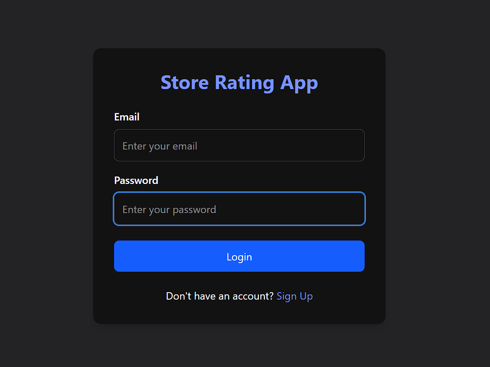
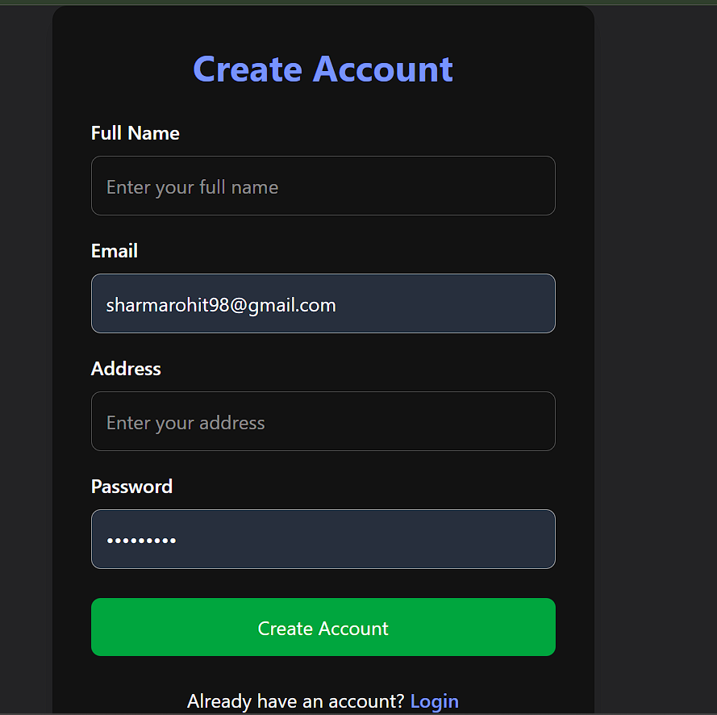
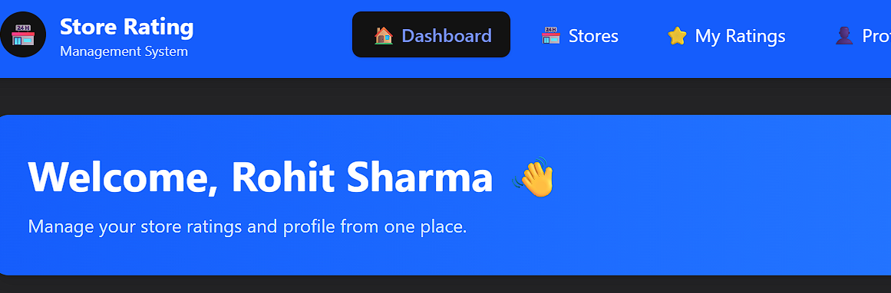
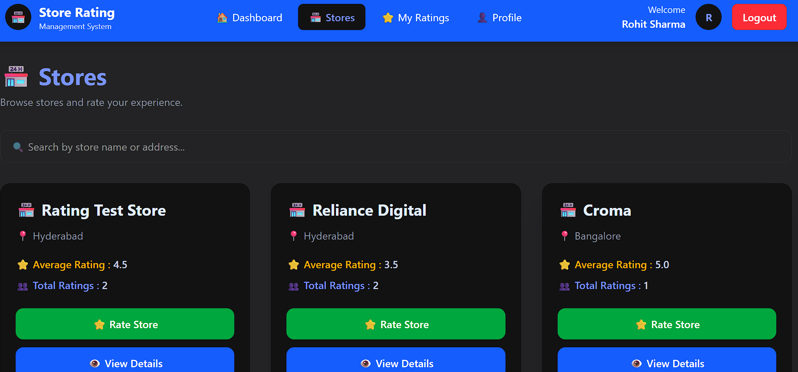
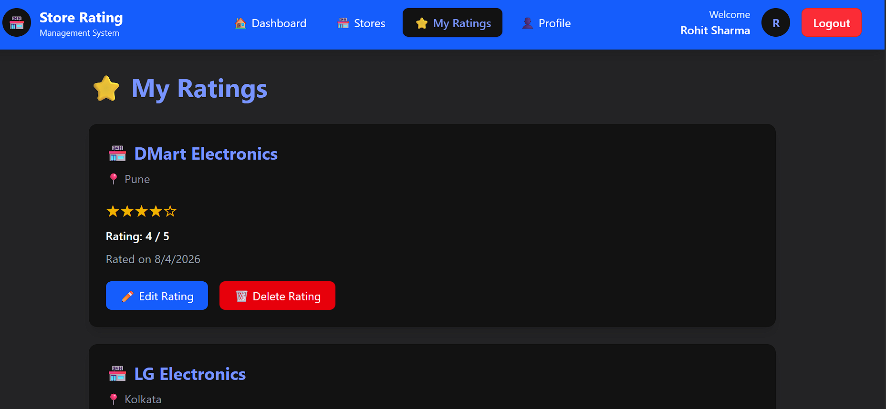
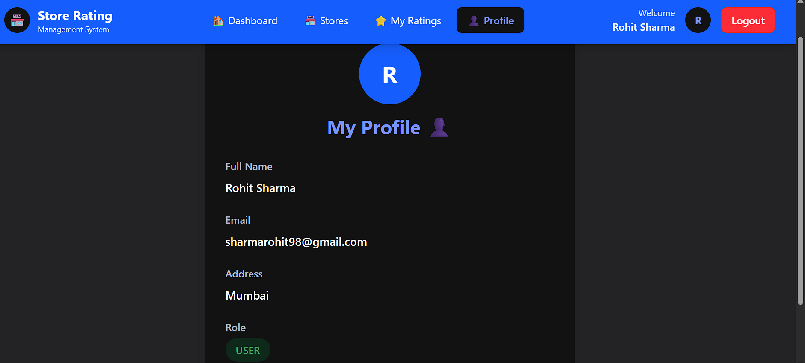

# ⭐ Store Rating Management System
## 📌 Project Description

Store Rating Management System is a full-stack web application that allows users to browse stores, submit ratings, manage their reviews, and view personalized dashboard statistics.

The application provides secure authentication, role-based access control, RESTful APIs, and a responsive user interface for managing store ratings efficiently.

The project is developed using modern web technologies with a focus on clean architecture, scalability, and real-world application practices.

## 🛠 Tech Stack

### Frontend
- **React.js** - Building the interactive user interface
- **Vite** - Fast frontend development and build tool
- **React Router DOM** - Client-side routing and navigation
- **Tailwind CSS** - Responsive and modern UI styling
- **Axios** - API communication between frontend and backend

### Backend
- **Node.js** - JavaScript runtime environment
- **Express.js** - Backend framework for building RESTful APIs
- **JWT (JSON Web Token)** - Secure user authentication and protected routes
- **bcrypt.js** - Password hashing and security

### Database
- **PostgreSQL** - Relational database for storing users, stores, and ratings data
- **pg (Node PostgreSQL Client)** - Connecting backend services with PostgreSQL database

### Development Tools
- **Postman** - API testing and debugging
- **Git & GitHub** - Version control and source code management
- **VS Code** - Development environment
- **npm** - Package management


## ✨ Features

### 🔐 Authentication & Security
- User registration and login functionality
- Secure password encryption using bcrypt.js
- JWT-based authentication for secure API access
- Protected routes to restrict unauthorized access

### 📊 Dashboard
- Personalized user dashboard
- Displays user profile information
- Shows real-time statistics:
  - Total number of stores
  - Number of ratings submitted by the user
  - Total ratings available in the system

### 🏪 Store Management
- View all available stores
- View detailed store information
- Browse stores and submit ratings

### ⭐ Rating Management
- Submit ratings for stores
- Update existing ratings
- Delete ratings
- View personal rating history

### 👤 Profile Management
- View user profile details
- Display user information including name, email, address, and role

### 🎨 User Interface
- Responsive design using Tailwind CSS
- Clean navigation with reusable components
- Loading states for better user experience
- Client-side routing using React Router

### ⚙️ Backend & API
- RESTful API architecture
- Modular Express.js route structure
- PostgreSQL database integration
- Secure middleware-based authentication


## 📦 Installation & Setup

Follow the steps below to run the Store Rating Management System locally.

### Prerequisites

Before starting, make sure you have installed:

- Node.js (v18 or above)
- npm (Node Package Manager)
- PostgreSQL
- Git

---

## Step 1: Clone the Repository

Clone the project repository:

```bash
git clone <repository-url>

## ⚡ Quick Start Commands

Follow these commands to run the project.

---

## Backend Commands

### Navigate to Backend Folder

```bash
cd backend
npm install
Backend will run on:
http://localhost:5000

Navigate to frontend folder:
cd frontend
npm install
npm run dev

Frontend will run on:
http://localhost:5173

## 🔑 Environment Variables

The backend application uses environment variables to securely store configuration details and sensitive information.

Create a `.env` file inside the `backend` folder:


Add the following variables:

```env

Add the following variables:

```env
PORT=5000

DB_USER=your_postgresql_username
DB_HOST=localhost
DB_NAME=rating_app
DB_PASSWORD=your_postgresql_password
DB_PORT=5432

JWT_SECRET=your_secret_key

## 🔗 API Endpoints

The application follows a RESTful API architecture for communication between the frontend and backend.

All protected routes require a JWT token in the request header:

```http
Authorization: Bearer <JWT_TOKEN>
| Method | Endpoint            | Description                              |
| ------ | ------------------- | ---------------------------------------- |
| POST   | `/api/auth/signup`  | Register a new user account              |
| POST   | `/api/auth/login`   | Authenticate user and generate JWT token |
| GET    | `/api/auth/profile` | Get logged-in user profile details       |
| PUT    | `/api/auth/profile` | Update user profile information          |

| Method | Endpoint          | Description                  |
| ------ | ----------------- | ---------------------------- |
| GET    | `/api/stores`     | Retrieve all stores          |
| GET    | `/api/stores/:id` | Retrieve store details by ID |
| POST   | `/api/stores`     | Create a new store           |
| PUT    | `/api/stores/:id` | Update store information     |
| DELETE | `/api/stores/:id` | Delete a store               |

| Method | Endpoint           | Description                                 |
| ------ | ------------------ | ------------------------------------------- |
| POST   | `/api/ratings`     | Submit a rating for a store                 |
| GET    | `/api/ratings/my`  | Get ratings submitted by the logged-in user |
| PUT    | `/api/ratings/:id` | Update an existing rating                   |
| DELETE | `/api/ratings/:id` | Delete a rating                             |

| Method | Endpoint               | Description                   |
| ------ | ---------------------- | ----------------------------- |
| GET    | `/api/dashboard/stats` | Retrieve dashboard statistics |

## 📸 Screenshots

### 🔐 Login Page

User authentication page where users can securely log in to access the application.




### 📝 Signup Page

Registration page for creating a new user account.




### 📊 Dashboard

Personalized dashboard displaying user information and real-time statistics.




### 🏪 Stores Page

Users can browse available stores and view store details.




### ⭐ Rating Management

Users can submit, update, and delete store ratings.




### 👤 Profile Page

Users can view and update their profile information.




## 🚀 Future Improvements

The following enhancements can be added to improve scalability, usability, and overall user experience.

### 👨‍💼 Admin Dashboard
- Manage users and stores
- View system-wide statistics
- Monitor ratings and user activity

### 🏪 Store Owner Features
- Store owner dashboard
- View customer ratings and feedback
- Track store performance analytics

### 📊 Advanced Analytics
- Rating distribution charts
- Store performance graphs
- User activity reports

### 🔔 Notifications
- Email notifications for rating updates
- Account activity alerts
- Important system notifications

### 🌐 Deployment & Cloud Integration
- Deploy frontend using platforms like Vercel
- Deploy backend using cloud services
- Use managed PostgreSQL database services

### 🔒 Enhanced Security
- Password reset functionality
- Email verification
- Role-based access control improvements

### 📱 Mobile Application
- Develop a mobile version using React Native
- Provide a better mobile user experience